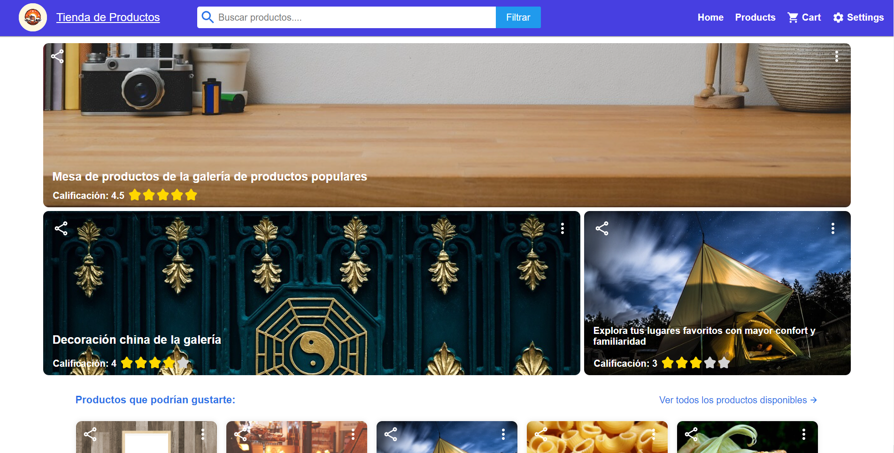
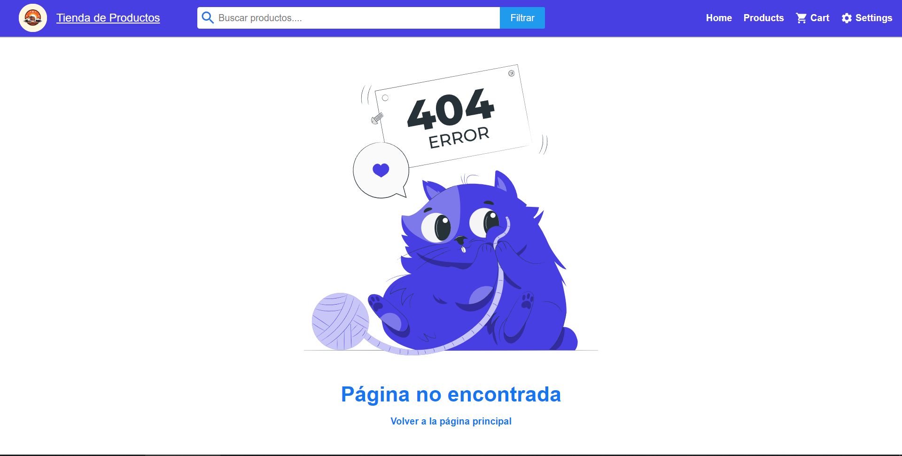
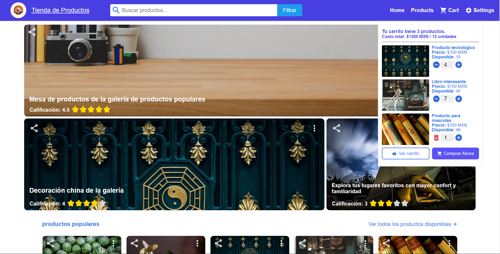

# Proyecto Tienda Online ✨✨

## Descripción

### El objetivo de este proyecto es desarrollar una aplicación completamente funcional de una tienda online, incluyendo tanto el frontend como el backend con la base de datos integrada. Se ha puesto especial atención en el diseño de los estilos para que sean coherentes, agradables y fáciles de entender para usuarios de todas las edades y nacionalidades

#### El proyecto se ha dividido en dos partes: el frontend y el backend. El frontend se encarga de la interfaz de usuario, mientras que el backend se encarga de la lógica de negocios y la base de datos

## 📸 Vista previa del proyecto^^ 👀

### Una vez que se haya completado el proyecto, se hará un videotutorial para explicando el funcionamiento de la aplicación y los pasos que se han seguido para desarrollarla





### En Desarrollo
- Aun esta en desarrollo y va ser lento pero progresivos los cambios que se van implementar.

## Tecnologías Utilizadas

### Frontend

- **React.js**: Biblioteca JavaScript de código abierto para construir interfaces de usuario.
- **Vite**: Bundler moderno para aplicaciones web.
- **HTML/CSS/JavaScript**: Tecnologías fundamentales para la creación de interfaces web.

### Backend

- **Node.js**: Entorno de ejecución de JavaScript del lado del servidor.
- **Express**: Framework web minimalista para Node.js.
- **Base de datos**: PostgreSQL.

## Requisitos Previos

Antes de comenzar, asegúrate de tener instalado lo siguiente:

- Node.js (versión recomendada)
- npm (o yarn si lo prefieres)
- Git

## Instalación

1. **Clonar el Repositorio:**

   ```bash
   git clone https://github.com/tu-usuario/tu-proyecto.git](https://github.com/SergioDavidFernandezVilla/Proyecto-1-CON-REACT-JS-Tienda_Online/edit/main/README.md
   cd tu-proyecto
